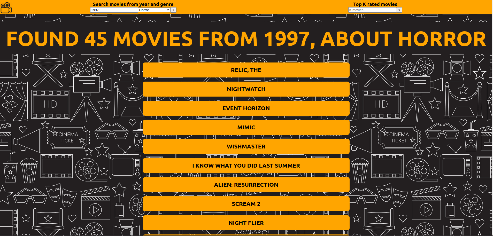
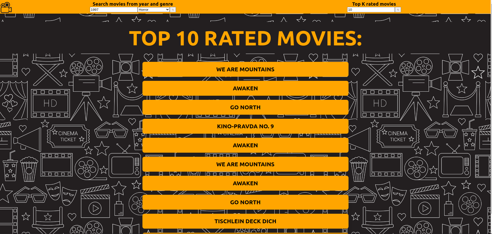

# Programming Challenge

## Description

This application consists of a programming challenge for the vacancy of developer at SIDIA, where such application will list films given a year and genre and the top k films well evaluated in descending order.

For the preparation of data, python was used due to it's fast and simplified use for such operations. MySQL was the database of choice, because of my familiarity with it. Also, in the backend, Express and Sequelize, to create the routes (MVC model) and manage the database, respectively. And finally, in the frontend, I've used node with react to easily create a graphical interface.

## How to run


### Step 1 - Prepare Data

#### Dependencies

- pandas (pip3 install pandas)
- mysql (pip3 install mysql-connector-python)

#### How to prepare

 - You must first download the [publicly available dataset](http://files.grouplens.org/datasets/movielens/ml-25m.zip);

 - Extract the downloaded file and copy the files ```movies.csv``` and ```ratings.csv``` to the ```preparing-data``` folder;

 - Execute  ```python3 treatingData.py```.

After the treatmentData has finished running

- Execute ```python3 createdDatabase.py your_host user_name password database_name ```,

After the createdDatabase has finished running 

- Execute ```python3 populateDatabase.py your_host user_name password database_name ```.


### Step 2 - Run the API

#### Dependecies

- Node (currently using v10.19.0)


#### How to run

- Firstly, run ```npm install``` inside the /api folder, to install the project's dependecies;
- Then, correctly input your database configuration inside /api/config/database.json. It should be the same as the one you created in the first step (preparing data);
EXAMPLE:
```javascript
{
  "development": { 
    "username": "userExample",
    "password": "example123",
    "database": "example",
    "host": "localhost",
    "dialect": "mysql"
  }
}
```

- Secondly, run ```npm start``` to initiate the API.

- Done.


### Step 3 - Run the app

#### Dependecies

- Node (currently using v10.19.0)

#### How to run

- Firstly, run ```npm install``` inside the /api folder, to install the project's dependecies;

- Secondly, run ```npm start``` to initiate the app;

- Then, you should be able to access by going to ```http://localhost:3001```

- Done.

## Screenshots 
### Initial


### List movies by year and genre



### List top k rated movies

